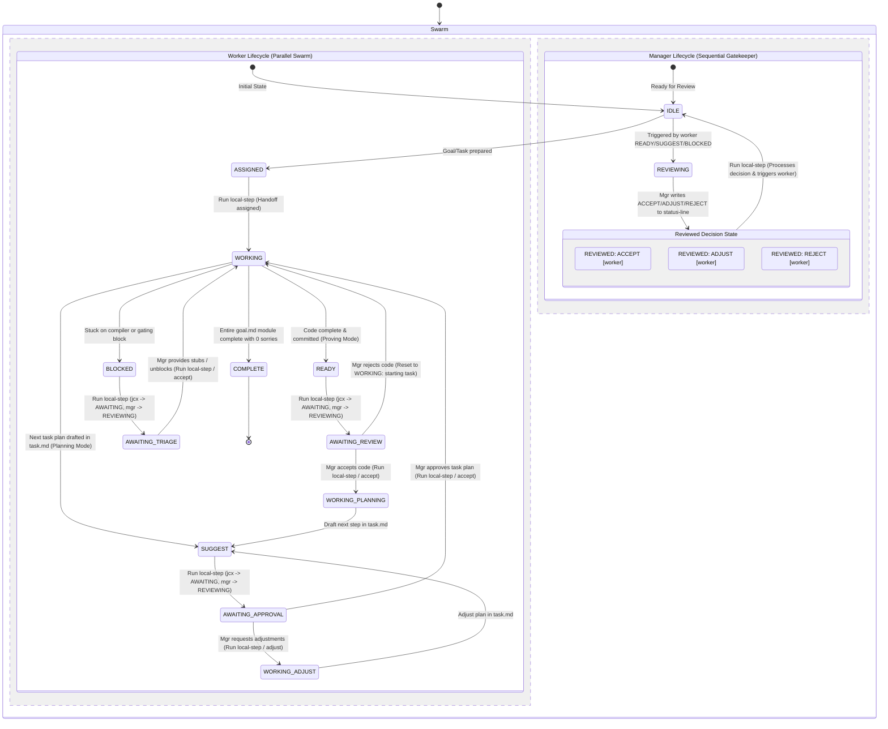

# Swarm State Machine & Collaborative Protocol

This document defines the formal state machine and collaborative software engineering protocol used by the `scialect` orchestrator and the multi-agent worker swarm.

---

## 1. Concurrent State Diagram (Petri Net Analogy)

Because the worker swarm runs multiple nodes (`jc0` to `jc5`) concurrently while a single manager (`mgr`) handles code reviews and task approvals sequentially, the system is modeled as a **concurrent state machine** (similar to a Petri Net or a UML Activity Diagram with parallel swimlanes).

The diagram below shows the parallel lifecycles of a Worker and the Manager, and highlights how the interactive `local-step` orchestrator coordinates tokens (state changes) between them:

---

## 2. Petri Net & UML Activity Diagram Conceptual Model

The swarm behaves fundamentally like a **Petri Net** or a **UML Activity Diagram with Swimlanes** rather than a single sequential state machine:

1.  **Token-Based Coordination**: 
    Workers and managers don't block each other's execution threads. Instead, they deposit "tokens" into status files (`.sci/status-line`). For instance, a worker depositing a `READY` token fires an asynchronous state transition.
2.  **Concurrency Swimlanes (UML Activity)**:
    Multiple workers are active in their own "working" swimlanes. The manager acts as an asynchronous synchronization barrier. 
3.  **The AWAITING Buffer State**:
    To prevent the coordinator from re-triggering the same handoff in subsequent scans, the interactive orchestrator (`local-step`) acts as a transition rule that consumes a worker's `READY`/`SUGGEST`/`BLOCKED` token, moves the worker to a safe `AWAITING` buffer, and allocates the `REVIEWING` task to the manager.

---

## 3. Worker Status Specification

A worker reports its current state by writing exactly one line to `.sci/status-line` (and keeping the first line of `task.md` in sync) using the format `[STATUS]: [detail]`:

1.  **`IDLE: [detail]`**
    *   *Meaning*: The worker has no active goal and is waiting for an assignment.
2.  **`ASSIGNED: [goal_detail]`**
    *   *Meaning*: The manager or orchestrator has prepared a new overall `goal.md` and initial `task.md`, and is about to trigger the worker.
3.  **`WORKING: [current_step]`**
    *   *Meaning*: The worker is actively developing and proving the current commit-sized step in `task.md`, or is actively planning/adjusting their next step.
4.  **`READY: [current_step]`**
    *   *Meaning*: The worker has completed the current `task.md` step, successfully run `lake build`, committed the changes, and is **ready for the manager (`mgr`) to review the code**.
5.  **`SUGGEST: [proposed_task]`**
    *   *Meaning*: The worker has completed the planning phase, written the proposed next step into `task.md`, and is **ready for the manager (`mgr`) to approve the new task plan**.
6.  **`BLOCKED: [reason]`**
    *   *Meaning*: The worker is genuinely blocked (cross-group gating or compiler/universe error) and has appended a triage report to the bottom of `task.md`.
7.  **`AWAITING: [detail]`**
    *   *Meaning*: The worker has submitted code or plans and is temporarily paused, waiting for the manager to complete the review or triage.
8.  **`COMPLETE: [goal_description]`**
    *   *Meaning*: The worker has successfully completed their **entire `goal.md` module**, verified that the entire target builds with zero `sorry`s, and is completely done with their overall phase.

---

## 4. Manager (Reviewer) Status Specification

The manager (`mgr`) is an active participant in the workflow. Its own `.sci/status-line` is polled by the server to coordinate handoffs:

1.  **`IDLE: [detail]`**
    *   *Meaning*: The manager is ready for a new review, adjustment, or triage assignment.
2.  **`REVIEWING: [worker]`**
    *   *Meaning*: The manager is actively conducting a review of the target worker's task (either code review or plan approval).
3.  **`REVIEWED: [DECISION] [worker]`**
    *   *Meaning*: The manager has completed the review. The deterministic orchestrator server reads this status to know the exact judgement and execute the required action, before resetting the manager's status back to `IDLE`.
    *   *Possible Decisions*:
        *   `REVIEWED: ACCEPT [worker]` — Accept the work / plan, merge commits (if code), and transition worker to `WORKING`.
        *   `REVIEWED: ADJUST [worker]` — Task plan needs adjustments (worker transitions to `WORKING: adjust plan`).
        *   `REVIEWED: REJECT [worker]` — Worker must roll back their changes completely and start over (with a fresh `task.md` and new session).

---

## 5. Handoff Coordination Commands (`local-step` & `tell-worker`)

The orchestrator script `local-step` drives all worker/manager handoffs, copying version-controlled guides from `rules/` to `.sci/` during execution:

*   **`assigned`** (`tell-worker -- <worker> assigned`):
    *   *Prompt Guide*: `proving-guide.md`
    *   *Action*: Initial handoff of the goal and the first task to the worker. Transitions worker to `WORKING`.
*   **`review`** (`tell-worker -- mgr review <worker>`):
    *   *Prompt Guide*: `review-guide.md`
    *   *Action*: Assert `mgr` is `IDLE`. Transitions `mgr` to `REVIEWING: <worker>` and prompts the manager to review the worker's completed code.
*   **`accept`** (`tell-worker -- <worker> accept`):
    *   *Prompt Guide*: `proving-guide.md`
    *   *Action*: Prompts the accepted worker to enter planning mode, re-read `plan.md`, and write their next task plan to `task.md`. Transitions worker to `WORKING`.
*   **`approve-task`** (`tell-worker -- mgr approve-task <worker>`):
    *   *Prompt Guide*: `approve-task-guide.md`
    *   *Action*: Assert `mgr` is `IDLE`. Transitions `mgr` to `REVIEWING: <worker>` and prompts the manager to review/approve the proposed task plan in the worker's `task.md`.
*   **`adjust`** (`tell-worker -- <worker> adjust`):
    *   *Prompt Guide*: `adjust-guide.md`
    *   *Action*: Prompts the worker to adjust their proposed task plan in `task.md` based on manager feedback. Transitions worker to `WORKING`.
*   **`unblock`** (`tell-worker -- mgr unblock <worker>`):
    *   *Prompt Guide*: `unblock-guide.md`
    *   *Action*: Assert `mgr` is `IDLE`. Transitions `mgr` to `REVIEWING: <worker>` and prompts the manager to triage the blocker.
